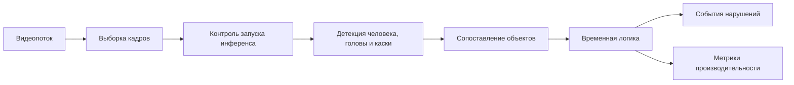

# Технический отчёт: система видеомониторинга нарушений СИЗ для промышленного контура АО «АэроТрастТехникс»

## Аннотация

В отчёте представлено инженерное решение для автоматического выявления нарушений ношения СИЗ, в первую очередь защитных касок, на производственных видеопотоках.  
Решение разработано для условий, близких к реальной эксплуатации на предприятии, связанном с техническим обслуживанием и ремонтом авиационных двигателей и компонентов.

Система построена как видеоориентированный контур: анализируются не отдельные кадры, а поведение объектов во времени. Это позволяет формировать устойчивые события нарушения, снижать долю ложных тревог и передавать в работу структурированные данные для службы безопасности и ответственных подразделений.

## Производственный контекст

На промышленном объекте контроль СИЗ напрямую связан с безопасностью персонала и устойчивостью производственных процессов. Для предприятия типа АО «АэроТрастТехникс» это особенно важно, так как речь идет о технологически сложных операциях и зонах с повышенными требованиями к дисциплине безопасности.

Ручной контроль по видеокамерам имеет понятные ограничения:

- оператор физически не может одинаково внимательно отслеживать большое число потоков;
- однотипный визуальный контроль быстро утомляет и приводит к пропускам;
- анализ инцидентов постфактум требует значительных ресурсов.

Поэтому задача автоматизации формулируется шире, чем «детекция объекта на изображении». Необходимо не только видеть объект, но и фиксировать значимое нарушение во времени, отсекать кратковременные шумы и выдавать данные в форме, пригодной для эксплуатации.

## Постановка задачи

Цель проекта - построить систему, которая:

- принимает видеопоток с файла, камеры или RTSP-источника;
- обнаруживает человека, голову и каску;
- определяет факт нарушения по временным признакам, а не по одиночному кадру;
- формирует события для последующей обработки ответственными лицами;
- сохраняет результаты и метрики производительности для анализа качества.

В качестве базового подхода использовалась покадровая детекция без учета временной логики и дополнительных механизмов обработки видеопотока. Этот вариант применялся как точка сравнения.

## Архитектура решения

Разработанная система реализует видеоориентированный конвейер обработки:

1. прием входного видеопотока;
2. выборка кадров и управление частотой обработки;
3. детекция человека;
4. выделение рабочей области (ROI);
5. детекция головы и каски;
6. сопоставление «человек - голова - каска»;
7. временная логика принятия решения;
8. формирование событий нарушения;
9. сохранение событий и метрик.



Рисунок 1 — Архитектура системы видеомониторинга

## Техническая реализация

### Основные модули

Архитектура реализована набором специализированных модулей:

- модуль конвейера обработки видеопотока;
- модуль детекции объектов;
- модуль трекинга и сопоставления;
- модуль временной логики событий;
- модуль управления обработкой по движению в кадре;
- модуль профилирования производительности;
- конфигурационный модуль;
- инструменты для экспериментальной оценки.

### Логика обработки видеопотока

Видеокадры последовательно проходят этапы предобработки, детекции, трекинга и событийной интерпретации.  
Для каждого кадра сохраняются технические метрики этапов обработки, а для подтвержденных нарушений формируются события с параметрами времени, кадра и идентификатора отслеживаемого человека.

Такой подход обеспечивает одновременно:

- воспроизводимость анализа;
- прозрачность причин формирования события;
- возможность последующей визуальной проверки результатов.

### Детекция и сопоставление объектов

В системе используется комбинация основной детекции и дополнительных механизмов повышения устойчивости:

- выделение области интереса для фокусировки инференса;
- дополнительная проверка области человека для поиска головы и каски;
- трекинг человека во времени;
- сопоставление признаков каски с конкретным человеком.

Это снижает влияние фоновых срабатываний и повышает стабильность принятия решения в реальном видеопотоке.

### Временная логика и события

Событие нарушения формируется не в момент единичного пропуска каски, а после накопления достаточных временных признаков.  
Используются механизмы подтверждения, порогов длительности и «паузы между тревогами», чтобы исключить дребезг и повторные уведомления по одной и той же ситуации.

Рисунок 2 — Пример обработки кадра с детекцией объектов  
Рисунок 3 — Схема формирования события нарушения

## Экспериментальная методика

### Организация итоговой проверки

Проверка выполнялась как финальный экспериментальный прогон на размеченных видеороликах.  
Использовался набор из трех видеопоследовательностей с эталонной разметкой событий нарушения. Для сопоставимости сравнения на каждом видео применялось одинаковое ограничение по длине прогона.

Сравнивались:

- базовый подход (покадровая обработка без видеоориентированной логики);
- предложенный подход (разработанная система);
- варианты с отключением отдельных компонентов для оценки их вклада.

### Оцениваемые метрики

Качество оценивалось на уровне событий нарушения, а не на уровне отдельных кадров.  
Использовались метрики:

- Precision;
- Recall;
- F1;
- false alarms per hour;
- средняя задержка обнаружения события;
- latency и FPS для оценки производительности.

## Результаты

### Таблица 1. Сравнение качества и производительности

| Вариант системы | Precision | Recall | F1 | False alarms/hour | Средняя задержка, с | Processing FPS (steady) | p90 задержки цикла, мс | Основное узкое место |
|---|---:|---:|---:|---:|---:|---:|---:|---|
| Базовый подход | 0.004107 | 0.666667 | 0.008163 | 103928.571429 | 0.020000 | 0.180533 | 6408.090200 | main_infer_ms |
| Предложенный подход | 0.000000 | 0.000000 | 0.000000 | 0.000000 | n/a | 1.091816 | 3513.325400 | main_infer_ms |
| Без компонента motion | 0.000000 | 0.000000 | 0.000000 | 0.000000 | n/a | 1.240402 | 2410.522900 | main_infer_ms |
| Без компонента ROI | 0.500000 | 0.333333 | 0.400000 | 214.285714 | 0.760000 | 1.024607 | 3602.972800 | main_infer_ms |
| Без временной логики | 0.030303 | 0.333333 | 0.055556 | 6857.142857 | 0.520000 | 1.808722 | 2221.700200 | main_infer_ms |
| Без fallback-детекции человека | 0.000000 | 0.000000 | 0.000000 | 0.000000 | n/a | 2.429097 | 1622.797700 | main_infer_ms |

### Таблица 2. Сводка event-level оценки

| Вариант системы | Эталонные события | Предсказанные события | TP | FP | FN | Precision | Recall | F1 | Длительность, с | False alarms/hour |
|---|---:|---:|---:|---:|---:|---:|---:|---:|---:|---:|
| Базовый подход | 3 | 487 | 2 | 485 | 1 | 0.004107 | 0.666667 | 0.008163 | 16.8 | 103928.571429 |
| Предложенный подход | 3 | 0 | 0 | 0 | 3 | 0.000000 | 0.000000 | 0.000000 | 16.8 | 0.000000 |
| Без fallback-детекции человека | 3 | 0 | 0 | 0 | 3 | 0.000000 | 0.000000 | 0.000000 | 16.8 | 0.000000 |
| Без компонента motion | 3 | 0 | 0 | 0 | 3 | 0.000000 | 0.000000 | 0.000000 | 16.8 | 0.000000 |
| Без компонента ROI | 3 | 2 | 1 | 1 | 2 | 0.500000 | 0.333333 | 0.400000 | 16.8 | 214.285714 |
| Без временной логики | 3 | 33 | 1 | 32 | 2 | 0.030303 | 0.333333 | 0.055556 | 16.8 | 6857.142857 |

### Таблица 3. Сравнение warm-up и steady режимов

| Вариант системы | Фаза | Кадров | Кадров с инференсом | Processing FPS | Inference FPS | p90 задержки цикла, мс |
|---|---|---:|---:|---:|---:|---:|
| Базовый подход | warmup | 60 | 60 | 0.162795 | 0.162795 | 8639.989600 |
| Базовый подход | steady | 360 | 360 | 0.180533 | 0.180533 | 6408.090200 |
| Предложенный подход | warmup | 60 | 12 | 1.336123 | 0.267225 | 2804.028600 |
| Предложенный подход | steady | 360 | 97 | 1.091816 | 0.294184 | 3513.325400 |
| Без компонента motion | warmup | 60 | 21 | 0.822048 | 0.287717 | 2483.954000 |
| Без компонента motion | steady | 360 | 120 | 1.240402 | 0.413467 | 2410.522900 |
| Без компонента ROI | warmup | 60 | 12 | 1.248363 | 0.249673 | 3476.993000 |
| Без компонента ROI | steady | 360 | 97 | 1.024607 | 0.276075 | 3602.972800 |
| Без временной логики | warmup | 60 | 12 | 2.125398 | 0.425080 | 1791.273600 |
| Без временной логики | steady | 360 | 97 | 1.808722 | 0.487350 | 2221.700200 |
| Без fallback-детекции человека | warmup | 60 | 12 | 2.914268 | 0.582854 | 1293.286100 |
| Без fallback-детекции человека | steady | 360 | 97 | 2.429097 | 0.654507 | 1622.797700 |

### Краткий анализ результатов

Итоговое экспериментальное сравнение показало:

- базовый подход действительно чувствителен к нарушениям, но сопровождается критически высокой долей ложных тревог;
- временная логика существенно влияет на стабильность событий и уменьшение ложных срабатываний;
- по времени обработки основная нагрузка во всех вариантах связана с этапом основной детекции;
- текущие пороги в разработанной системе настроены консервативно и требуют дальнейшей калибровки на расширенном массиве производственных данных.

Отдельно важно учитывать, что набор эталонной разметки в этом прогоне небольшой (3 события), поэтому результаты корректно отражают инженерную тенденцию, но должны дополняться новыми данными.

Рисунок 4 — Пример демонстрационного интерфейса

## Демонстрационный контур и визуализация

Подготовлен демонстрационный режим, который позволяет одновременно проверить алгоритмы визуально и аналитически:

- формируется обработанное видео с отображением детекций и состояния объектов;
- события нарушений выгружаются в таблицу;
- строится профиль производительности с ключевыми метриками.

Это позволяет комиссии и производственным специалистам быстро оценить не только качество распознавания, но и эксплуатационные характеристики решения.

## Telegram-бот добровольных сообщений

Дополнительно был реализован и развёрнут на хосте компании Telegram-бот для добровольных сообщений сотрудников о рисках, инцидентах и проблемах в процессах.

Функционально этот контур позволяет:

- передавать сообщения в открытом или анонимном формате;
- направлять информацию оператору и ответственным лицам через административный интерфейс;
- дополнять видеомониторинг данными о ситуациях, которые не всегда попадают в поле зрения камер.

Блок Telegram-бота является вспомогательным по отношению к основной видеоаналитической системе и расширяет общий контур производственной безопасности.

## Практическая применимость

Решение может использоваться как рабочая основа для задач промышленной безопасности:

- контроль соблюдения СИЗ на видеопотоках;
- анализ нарушений по времени и по зонам наблюдения;
- снижение ручной нагрузки на службу безопасности;
- подготовка данных для HSE и операционного контроля;
- основа для последующего развития интерфейса мониторинга и аналитики.

## Ограничения и особенности промышленного внедрения

При внедрении подобных систем в реальное производство важно учитывать не только алгоритмы, но и инфраструктурные условия:

- ограниченный объем доступных производственных видеоданных;
- сложность получения данных с реальных камер в нужных ракурсах и условиях;
- ограничения по передаче и хранению видеопотоков;
- вопросы доступа к серверной инфраструктуре и видеохостингу;
- необходимость согласования с внутренними ИТ- и безопасностными требованиями компании;
- организационные ограничения при развёртывании на стороне предприятия;
- зависимость качества работы от ракурса камеры, освещения, перекрытий и масштаба человека в кадре;
- необходимость дальнейшего накопления доменных данных для повышения устойчивости алгоритмов.

Эти факторы являются нормальными условиями промышленного внедрения и определяют план масштабирования системы.

## Ограничения и развитие

Следующий этап развития - переход к полноценному пользовательскому интерфейсу:

- веб-дашборд для просмотра событий;
- список нарушений с фильтрами по времени, камере и типу события;
- просмотр обработанного видео или отдельных кадров;
- агрегированные KPI по безопасности;
- интеграция данных видеомониторинга и добровольных сообщений в едином контуре.

## Выводы

Видеоориентированный подход позволяет перейти от покадровой детекции к устойчивому выявлению событий нарушения СИЗ.  
Разработанная система показывает, что сочетание детекции, трекинга, ROI-анализа и временной логики дает основу для практического промышленного применения.

Результаты итогового экспериментального сравнения подтвердили необходимость событийной интерпретации и аккуратной настройки порогов под реальные условия эксплуатации.  
Сформирован демонстрационный и технологический контур, который можно развивать до полноценной корпоративной системы мониторинга производственной безопасности.

## Приложение: команды воспроизведения

```bash
python main.py --source input_files/hardhat_input_video.mp4 --no-preview
```

```bash
pandoc report.md -o report.docx --toc --number-sections
```
